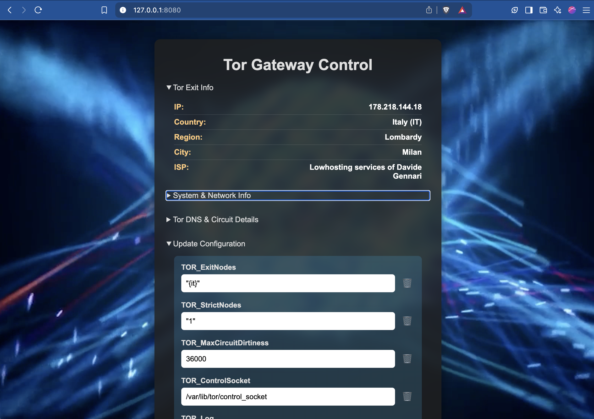

Below is the fully rewritten version using the requested style and correct markdown formatting:

# Tor Gateway



The **Tor Gateway** project is a lightweight, containerized solution that provides a secure and configurable entry point to the Tor network. Built on Alpine Linux with Privoxy and runit, it allows you to control Tor’s configuration via environment variables, making it ideal for professional and production-grade deployments.

## Overview

**Tor Gateway** leverages:

- **Alpine Linux** for a minimal and secure base.
- **Privoxy** as an HTTP proxy routing traffic through Tor.
- **runit** for process supervision, ensuring high reliability.
- **Environment Variables** (prefixed with `TOR_`) to configure the Tor daemon without manual file edits.

The project also includes a simple web user interface (UI) for viewing current Tor exit node details and updating configuration settings dynamically. Changes trigger an automatic container restart, reloading the updated settings from the `.env` file.

## Table of Contents

- [Prerequisites](#prerequisites)
- [Standalone Deployment](#standalone-deployment)
  - [Building the Image](#building-the-image)
  - [Configuring the Environment](#configuring-the-environment)
  - [Running the Container](#running-the-container)
  - [Verifying the Proxy](#verifying-the-proxy)
- [Docker Compose Integration](#docker-compose-integration)
  - [Sample Docker Compose Configuration](#sample-docker-compose-configuration)
  - [How It Works](#how-it-works)
  - [Deploying the Stack](#deploying-the-stack)
- [Additional Considerations](#additional-considerations)
  - [Troubleshooting](#troubleshooting)
  - [Security Recommendations](#security-recommendations)
- [F.A.Q](#faq)
- [References](#references)

## Prerequisites

Before you begin, ensure that you have the following installed:

- **Docker Engine**
- **Docker Compose**

Familiarity with basic Docker commands and networking concepts is assumed.

## Standalone Deployment

### Building the Image

Clone the repository and build the Docker image locally:

```bash
git clone https://github.com/redoracle/tor-gateway.git
cd tor-gateway
docker build -t tor-gateway .
```

This sequence clones the repository, changes into the project directory, and builds the image tagged as `tor-gateway`.

### Configuring the Environment

Customize the provided `.env` file to match your preferred Tor configuration. For example:

```ini
TOR_ExitNodes="{de},{nl},{fr},{se}"
TOR_StrictNodes="1"
TOR_MaxCircuitDirtiness=36000
TOR_Log="notice file /tmp/tor.log"
TOR_ControlPort=9052
TOR_SocksPort=9050
TOR_CookieAuthentication=1
TOR_HashedControlPassword="your-hashed-password"
```

Ensure the settings meet your operational requirements.

### Running the Container

Deploy the container in detached mode with the proper environment injection and volume mounting:

```bash
docker run -d \
  --restart unless-stopped \
  --name Tor-Gateway \
  -p 8118:8118 \
  -p 8080:5000 \
  --env-file "$(pwd)/.env" \
  -v "$(pwd)/.env:/home/dockeruser/.env" \
  tor-gateway:latest
```

This command starts the container with automatic restart, exposes the necessary ports, and ensures configuration updates are available at runtime.

### Verifying the Proxy

To verify that the proxy is operational, run:

```bash
curl --proxy http://localhost:8118 http://api.ipify.org/?format=json
```

Alternatively, open your web browser and navigate to [http://localhost:8080](http://localhost:8080) to access the UI.

## Docker Compose Integration

For more complex deployments that involve multiple services (such as Pi-hole, WireGuard, or AI crawling tools), you can integrate **Tor Gateway** into your Docker Compose configuration.

### Sample Docker Compose Configuration

Below is an example `docker-compose.yml` file that incorporates several services:

```yaml
services:
  crawl4ai:
    image: unclecode/crawl4ai:all-amd64
    container_name: crawl4ai
    hostname: crawl4ai
    restart: unless-stopped
    env_file:
      - $HOME/DATA/crawl4ai/.env
    volumes:
      - "$HOME/DATA/crawl4ai/config:/app/config"
      - "$HOME/DATA/crawl4ai/logs:/app/logs"
    healthcheck:
      test: ["CMD-SHELL", "curl -f http://localhost:11235/health || exit 1"]
      interval: 30s
      timeout: 10s
      retries: 3
    networks:
      red_net:
        ipv4_address: 172.13.0.210

  wireguard:
    image: linuxserver/wireguard:latest
    container_name: wireguard
    hostname: WireguardG
    privileged: true
    restart: unless-stopped
    entrypoint: ["/init"]
    ports:
      - "51820:51820/udp"
    volumes:
      - "$HOME/DATA/Wireguard/config:/config"
    environment:
      - PUID=1000
      - PGID=1000
      - SERVERPORT=51820
      - INTERNAL_SUBNET=172.3.0.0/24
      - PEERS=10
      - PEERDNS=1.1.1.1
      - TZ=Europe/Rome
      - PATH=/lsiopy/bin:/usr/local/sbin:/usr/local/bin:/usr/sbin:/usr/bin:/sbin:/bin
      - HOME=/root
      - TERM=xterm
      - VIRTUAL_ENV=/lsiopy
      - LSIO_FIRST_PARTY=true
    networks:
      red_net:
        ipv4_address: 172.13.0.14

  pihole:
    image: pihole/pihole:latest
    container_name: pihole
    hostname: piholeG
    restart: always
    tty: true
    stdin_open: true
    dns:
      - 1.0.0.1
      - 1.1.1.1
    cap_add:
      - NET_ADMIN
      - CAP_CHOWN
      - CAP_NET_BIND_SERVICE
      - CAP_NET_RAW
    volumes:
      - "$HOME/DATA/Pihole/etc-dnsmasq.d:/etc/dnsmasq.d"
      - "$HOME/DATA/Pihole/etc-pihole:/etc/pihole"
    environment:
      TZ: "Europe/Amsterdam"
      WEBPASSWORD: "piholePassword!"
      phpver: "php"
      PHP_ERROR_LOG: "/var/log/lighttpd/error-pihole.log"
      IPv6: "True"
      S6_KEEP_ENV: "1"
      S6_BEHAVIOUR_IF_STAGE2_FAILS: "2"
      S6_CMD_WAIT_FOR_SERVICES_MAXTIME: "0"
      FTLCONF_LOCAL_IPV4: "0.0.0.0"
      FTL_CMD: "no-daemon"
      DNSMASQ_USER: "root"
      PIHOLE_UID: "0"
      PATH: "/opt/pihole:/usr/local/sbin:/usr/local/bin:/usr/sbin:/usr/bin:/sbin:/bin"
    healthcheck:
      test: ["CMD-SHELL", "dig +short +norecurse +retry=0 @127.0.0.1 pi.hole || exit 1"]
      interval: 30s
      timeout: 10s
      retries: 3
    networks:
      red_net:
        ipv4_address: 172.13.0.15

  tor-gateway:
    image: tor-gateway:latest
    container_name: Tor-Gateway
    hostname: tor-gateway
    restart: unless-stopped
    env_file:
      - "$HOME/DATA/tor-gateway/.env"
    volumes:
      - "$HOME/DATA/tor-gateway/.env:/home/dockeruser/.env"
    networks:
      red_net:
        ipv4_address: 172.13.0.50

networks:
  red_net:
    driver: bridge
    ipam:
      config:
        - subnet: 172.13.0.0/24
```

### How It Works

- **Defined IP Range:** Each container is assigned a fixed IP within the `red_net` network, facilitating smooth inter-container communication.
- **Environment Configuration:** The `tor-gateway` service uses an external `.env` file for both startup configuration and dynamic runtime updates.
- **Port Exposure:** The proxy service (Privoxy on port 8118) and the web interface (port 8080) can be exposed through Docker or managed with a reverse proxy.
- **Service Chaining:** Other services, such as Pi-hole, can be configured to route DNS requests through the Tor Gateway, leveraging the anonymity network.
- **Health Checks:** Each container includes health checks to ensure services are running as expected and automatically restart if necessary.

### Deploying the Stack

Launch the multi-service stack with the following command:

```bash
docker compose -f docker-compose.yml up -d
```

To monitor the deployment in real time, use:

```bash
docker compose logs -f
```

This command displays real-time logs, helping you promptly detect and resolve any issues.

## Additional Considerations

### Troubleshooting

- **Container Startup:** Verify that the `.env` file is correctly configured and properly mounted.
- **Network Connectivity:** Ensure that the Docker network (`red_net`) is correctly defined and that containers can communicate.
- **Logs:** Use `docker compose logs` to review error messages or warnings that might indicate misconfiguration.

### Security Recommendations

- **Password Management:** Generate and store `TOR_HashedControlPassword` securely.
- **Sensitive Data:** Avoid exposing sensitive environment variables in public repositories; consider using Docker secrets.
- **Port Exposure:** Limit port exposure to trusted networks or use reverse proxies to manage external access.


## F.A.Q

**Q: I configured my Tor Gateway with `TOR_ExitNodes="{uk}"`, but it doesn’t connect using a United Kingdom IP. Why?**  
**A:** Tor uses the ISO 3166-1 alpha-2 country code for the United Kingdom, which is `{gb}` rather than `{uk}`. Update your configuration accordingly.

**Q: How do I force a runtime environment reload after updating the `.env` file?**  
**A:** The container’s environment is set at startup. To reload, restart the container. The web UI writes the updated configuration to `.env` and triggers a full restart via SIGTERM on PID 1.

**Q: Why are the runtime environment variables different from those in the `.env` file?**  
**A:** Docker only injects environment variables at startup from the `--env-file`. Any changes require a container restart to take effect.

**Q: My Tor circuit doesn’t change even after updating configuration. What’s wrong?**  
**A:** Ensure the environment variables are valid and that `torvariables.sh` writes the new configuration correctly to `/etc/tor/torrc`. Also, note that Tor may cache circuits for the duration specified by `TOR_MaxCircuitDirtiness`.

**Q: Can I run this container as a non-root user?**  
**A:** Yes, the container runs as a non-root user for enhanced security. However, certain operations (like sending SIGTERM to PID 1) may require root privileges. Advanced users can adjust privileges with tools like `gosu` or `su-exec`.

## References

- **Docker Hub:** `redoracle/tor-gateway`
- **Tor Project FAQ:** [Tor Usage](https://www.torproject.org/docs/faq)

The **Tor Gateway** project offers a secure, efficient, and configurable gateway to the Tor network. By leveraging environment variables, process supervision, and a dynamic web UI, it provides a robust solution for both isolated and integrated deployments. Contributions, issue reports, and pull requests are welcome—please refer to the repository guidelines for further details.

For any further inquiries or contributions, open an issue or submit a pull request on the project’s GitHub repository.